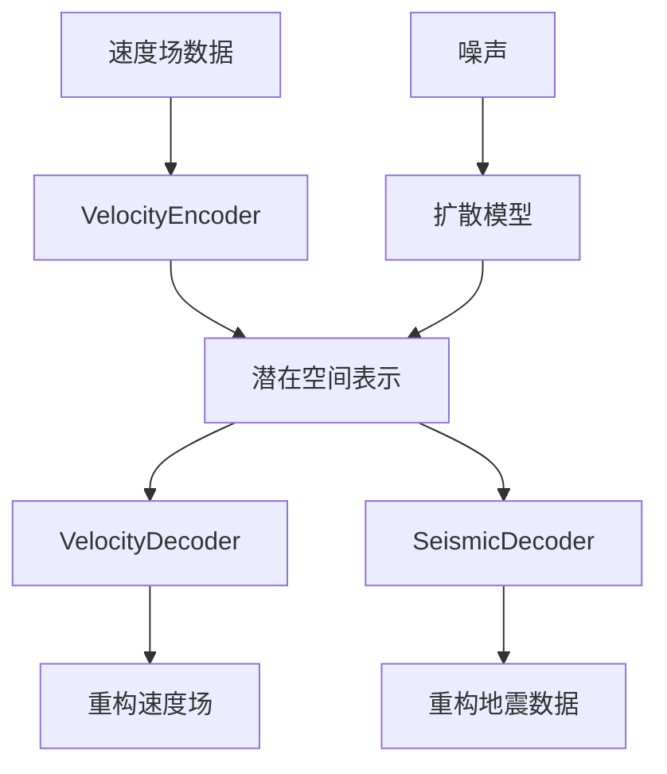

# UB-Diff 项目结构总览

## 项目简介

UB-Diff是一个用于地震数据和速度场生成的深度学习项目，采用编码器-解码器架构结合扩散模型的方法。项目经过重构，具有清晰的模块化设计和完整的训练-生成pipeline。

## 🏗️ 整体架构

```
UB-Diff/
├── model/                    # 核心模型模块
│   ├── components/          # 模型组件
│   ├── data/               # 数据处理模块
│   ├── trainers/           # 训练器模块
│   ├── generation/         # 数据生成模块
│   └── ub_diff.py         # 主模型类
├── scripts/                # 训练和生成脚本
├── checkpoints/           # 模型检查点
├── generated_data/        # 生成的数据
└── wandb/                # 实验记录
```

## 📁 详细模块说明

### 1. Model 核心模块 (`model/`)

#### 1.1 主模型类 (`ub_diff.py`)
- **UBDiff**: 整个项目的核心模型类
- 整合编码器、解码器和扩散模型
- 提供训练、生成、重构等核心接口
- 支持预训练模型加载和检查点保存

#### 1.2 模型组件 (`model/components/`)

| 文件 | 核心类/功能 | 作用描述 |
|------|------------|----------|
| `networks.py` | `ConvBlock`, `DeconvBlock`, `ResnetBlock`, `RMSNorm` | 基础网络层和构建块 |
| `encoder.py` | `VelocityEncoder` | 速度场编码器，将2D速度场编码到潜在空间 |
| `decoder.py` | `VelocityDecoder`, `SeismicDecoder`, `DualDecoder` | 各种解码器，从潜在空间重构数据 |
| `attention.py` | `LinearAttention`, `Attention`, `VisionTransformer` | 注意力机制和变换器组件 |
| `diffusion.py` | `Unet1D`, `GaussianDiffusion1D` | 1D扩散模型和U-Net架构 |
| `__init__.py` | - | 模块导出和接口定义 |

#### 1.3 数据处理模块 (`model/data/`)

| 文件 | 核心类/功能 | 作用描述 |
|------|------------|----------|
| `dataset.py` | `SeismicVelocityDataset` | 地震数据和速度场数据集类 |
| `transforms.py` | `LogTransform`, `MinMaxNormalize`, `复合变换` | 数据预处理和标准化变换 |
| `dataset_config.json` | - | 各数据集的配置信息和标准化参数 |
| `__init__.py` | 数据加载工具函数 | 数据加载器创建和反标准化函数 |

#### 1.4 训练器模块 (`model/trainers/`)

| 文件 | 核心类/功能 | 作用描述 |
|------|------------|----------|
| `encoder_decoder_trainer.py` | `EncoderDecoderTrainer` | 编码器-解码器联合训练 |
| `finetune_trainer.py` | `FinetuneTrainer` | 地震解码器微调训练 |
| `diffusion_trainer.py` | `DiffusionTrainer` | 扩散模型训练 |
| `utils.py` | 训练工具函数 | 参数统计、种子设置、学习率调度等 |
| `pytorch_ssim.py` | `SSIM` | 结构相似性损失函数 |
| `__init__.py` | - | 训练器导出和工具函数 |

#### 1.5 数据生成模块 (`model/generation/`)

| 文件 | 核心类/功能 | 作用描述 |
|------|------------|----------|
| `generator.py` | `UBDiffGenerator` | 数据生成器，支持批量生成、质量评估、插值 |
| `visualizer.py` | `ModelVisualizer` | 可视化工具，支持多种图表和对比展示 |
| `__init__.py` | - | 生成模块导出 |

### 2. Scripts 脚本模块 (`scripts/`)

| 脚本 | 功能 | 对应训练阶段 |
|------|------|-------------|
| `train_encoder_decoder.py` | 编码器-解码器训练 | 第一阶段：基础模型训练 |
| `finetune_seismic_decoder.py` | 地震解码器微调 | 第二阶段：解码器专门化 |
| `train_diffusion.py` | 扩散模型训练 | 第三阶段：生成模型训练 |
| `generate_data.py` | 数据生成和评估 | 生成阶段：使用训练好的模型 |

## 🚀 训练流程

### 三阶段训练策略


1. **阶段1 - 编码器解码器训练**
   - 训练速度场编码器和双解码器
   - 学习速度场到潜在空间的映射
   - 建立速度场和地震数据的基本关联

2. **阶段2 - 地震解码器微调**
   - 冻结编码器，专门优化地震解码器
   - 提高地震数据重构质量
   - 使用SSIM等高级损失函数

3. **阶段3 - 扩散模型训练**
   - 在潜在空间训练扩散模型
   - 学习生成高质量的潜在表示
   - 支持无条件生成

## 📊 数据流向



## 🛠️ 核心特性

### 模块化设计
- **单一职责原则**: 每个模块专注特定功能
- **接口清晰**: 模块间通过定义良好的接口交互
- **易于扩展**: 可轻松添加新的编码器、解码器或变换

### 类型安全
- **全面类型注解**: 所有函数和类都有详细的类型提示
- **参数验证**: 输入参数的格式和范围检查
- **错误处理**: 完善的异常处理机制

### 配置驱动
- **JSON配置**: 数据集参数通过配置文件管理
- **命令行参数**: 训练脚本支持丰富的命令行选项
- **灵活配置**: 支持不同数据集和实验设置

### 实验记录
- **WandB集成**: 自动记录训练指标和生成样本
- **检查点管理**: 定期保存和加载模型状态
- **可视化支持**: 内置丰富的可视化工具

## 🎯 使用指南

### 快速开始

1. **环境准备**
   ```bash
   pip install torch torchvision numpy matplotlib seaborn
   pip install wandb  # 可选，用于实验记录
   ```

2. **第一阶段训练**
   ```bash
   python scripts/train_encoder_decoder.py \
     --train_data /path/to/seismic/data \
     --train_label /path/to/velocity/data \
     --dataset flatvel-a \
     --epochs 300
   ```

3. **第二阶段微调**
   ```bash
   python scripts/finetune_seismic_decoder.py \
     --checkpoint_path /path/to/encoder_decoder/checkpoint \
     --train_data /path/to/seismic/data \
     --train_label /path/to/velocity/data \
     --dataset flatvel-a
   ```

4. **第三阶段扩散训练**
   ```bash
   python scripts/train_diffusion.py \
     --checkpoint_path /path/to/finetuned/checkpoint \
     --train_data /path/to/seismic/data \
     --train_label /path/to/velocity/data \
     --dataset flatvel-a
   ```

5. **数据生成**
   ```bash
   python scripts/generate_data.py \
     --checkpoint_path /path/to/final/checkpoint \
     --dataset flatvel-a \
     --num_samples 1000 \
     --visualize
   ```

### 高级用法

- **自定义数据集**: 修改`dataset_config.json`添加新数据集
- **模型调优**: 调整网络架构参数和训练超参数
- **质量评估**: 使用内置评估工具分析生成质量
- **潜在空间探索**: 利用插值功能探索潜在空间结构

## 📈 性能监控

项目提供多种性能监控和评估工具：

- **训练指标**: 损失函数、SSIM、重构误差
- **生成质量**: 统计指标、分布对比、Q-Q图
- **可视化对比**: 真实vs生成数据的并排展示
- **模型分析**: 参数统计、计算复杂度分析

## 🔧 扩展开发

### 添加新组件
1. 在`model/components/`中创建新模块
2. 实现必要的接口和类型注解
3. 在`__init__.py`中导出新组件
4. 更新`UBDiff`类以集成新组件

### 新数据集支持
1. 更新`dataset_config.json`配置
2. 如需特殊预处理，扩展`transforms.py`
3. 测试数据加载和标准化流程

### 新训练策略
1. 继承现有训练器基类
2. 实现特定的训练逻辑
3. 添加对应的命令行脚本

## 📚 相关文档

- `README.md`: 项目基本介绍和快速开始
- 各模块`__init__.py`: 详细的API文档
- 脚本文件: 命令行参数说明和使用示例

---

这个结构提供了从数据预处理到模型训练再到数据生成的完整pipeline，具有良好的可维护性和扩展性。 